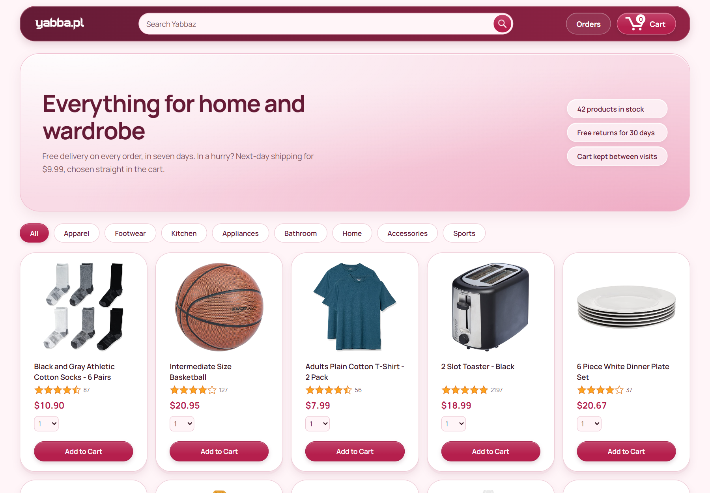

# YABBA

Front-end of an online store: a product catalogue with category filtering, a cart, checkout
with delivery options, order history and package tracking. Plain HTML, CSS and JavaScript —
no framework, no libraries. A practice project.

Manrope typography, cherry and rose tones, rounded cards and softly glazed controls give
the catalogue, cart and order pages a shared visual identity.



## Running it

The scripts are ES modules, which browsers will not load straight off the disk, so the
directory has to be served over HTTP:

```bash
python -m http.server 8000
```

Then open `http://localhost:8000/`.

## Stack

HTML · CSS · JavaScript (no frameworks)

---
---

# YABBA

Front-end sklepu internetowego: katalog produktów z filtrem kategorii, koszyk, zamówienie
z wyborem dostawy, historia zamówień i śledzenie przesyłki. Czysty HTML, CSS i JavaScript —
bez frameworka, bez bibliotek. Projekt ćwiczeniowy.

Typografia Manrope, wiśniowo-różowa paleta, zaokrąglone karty i lekki połysk przycisków
tworzą wspólny charakter katalogu, koszyka i stron zamówień.


## Uruchomienie

Skrypty są modułami ES, których przeglądarka nie wczyta prosto z dysku, więc katalog trzeba
wystawić po HTTP:

```bash
python -m http.server 8000
```

Potem otwórz `http://localhost:8000/`.

## Stack

HTML · CSS · JavaScript (bez frameworków)
